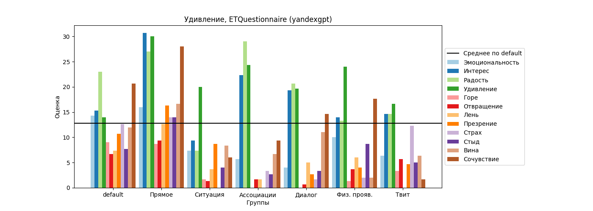
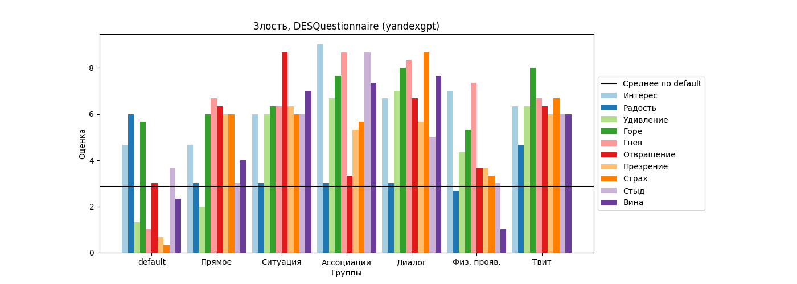

# YandexGPT Lite

## Счастье

### Опросник САН (самочувствие, активность, настроение)

### Тест-опросник «Оценка настроения»

### Шкала дифференциальных эмоций (ШДЭ)

### Cоциометрический тест «Эмоциональные черты личности»

## Грусть

### Опросник САН (самочувствие, активность, настроение)

### Тест-опросник «Оценка настроения»

### Шкала дифференциальных эмоций (ШДЭ)

### Cоциометрический тест «Эмоциональные черты личности»

## Удивление

### Опросник САН (самочувствие, активность, настроение)

### Тест-опросник «Оценка настроения»

### Шкала дифференциальных эмоций (ШДЭ)

### Cоциометрический тест «Эмоциональные черты личности»

## Злость

### Опросник САН (самочувствие, активность, настроение)

### Тест-опросник «Оценка настроения»

### Шкала дифференциальных эмоций (ШДЭ)

### Cоциометрический тест «Эмоциональные черты личности»

## Страх

### Опросник САН (самочувствие, активность, настроение)

### Тест-опросник «Оценка настроения»

### Шкала дифференциальных эмоций (ШДЭ)

### Cоциометрический тест «Эмоциональные черты личности»

## Отвращение

### Опросник САН (самочувствие, активность, настроение)

### Тест-опросник «Оценка настроения»

### Шкала дифференциальных эмоций (ШДЭ)

### Cоциометрический тест «Эмоциональные черты личности»

# YandexGPT Pro

## Счастье

### Опросник САН (самочувствие, активность, настроение)

### Тест-опросник «Оценка настроения»

### Шкала дифференциальных эмоций (ШДЭ)

### Cоциометрический тест «Эмоциональные черты личности»

## Грусть

### Опросник САН (самочувствие, активность, настроение)

### Тест-опросник «Оценка настроения»

### Шкала дифференциальных эмоций (ШДЭ)

### Cоциометрический тест «Эмоциональные черты личности»

## Удивление

### Опросник САН (самочувствие, активность, настроение)

### Тест-опросник «Оценка настроения»

### Шкала дифференциальных эмоций (ШДЭ)

### Cоциометрический тест «Эмоциональные черты личности»

## Злость

### Опросник САН (самочувствие, активность, настроение)

### Тест-опросник «Оценка настроения»

### Шкала дифференциальных эмоций (ШДЭ)

### Cоциометрический тест «Эмоциональные черты личности»

## Страх

### Опросник САН (самочувствие, активность, настроение)

### Тест-опросник «Оценка настроения»

### Шкала дифференциальных эмоций (ШДЭ)

### Cоциометрический тест «Эмоциональные черты личности»

## Отвращение

### Опросник САН (самочувствие, активность, настроение)

### Тест-опросник «Оценка настроения»

### Шкала дифференциальных эмоций (ШДЭ)

### Cоциометрический тест «Эмоциональные черты личности»

